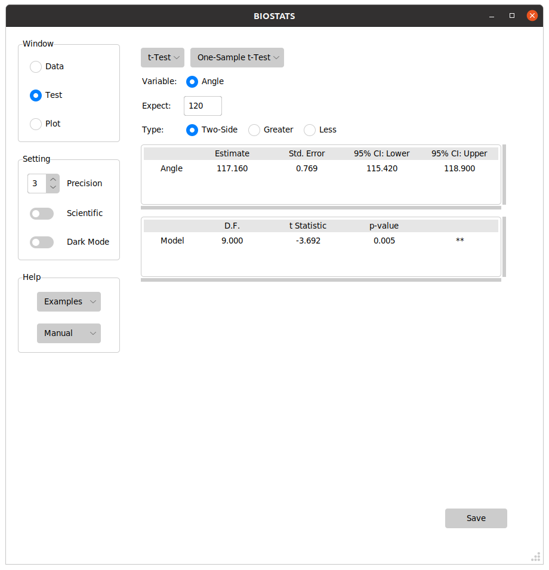
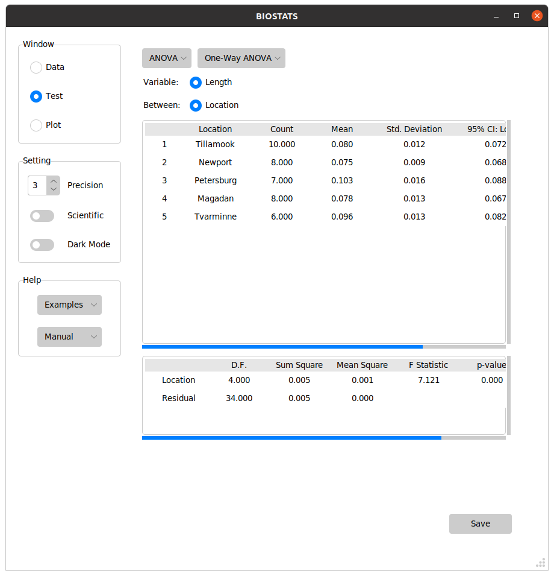
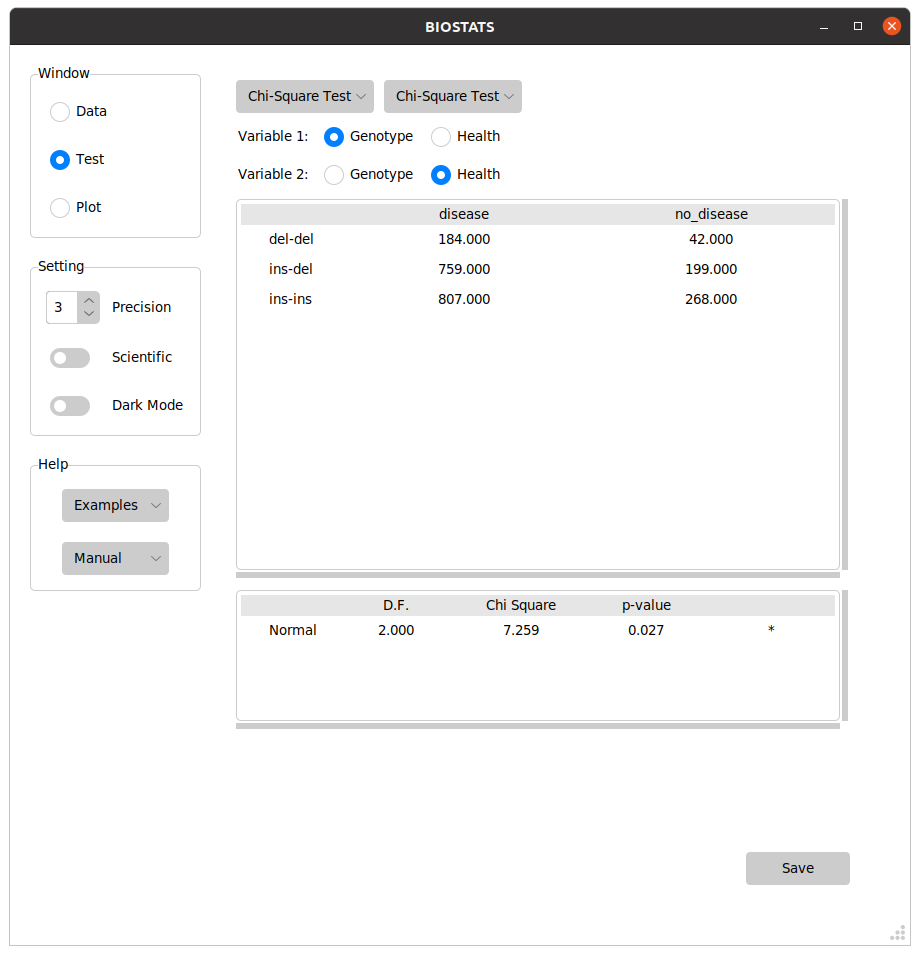
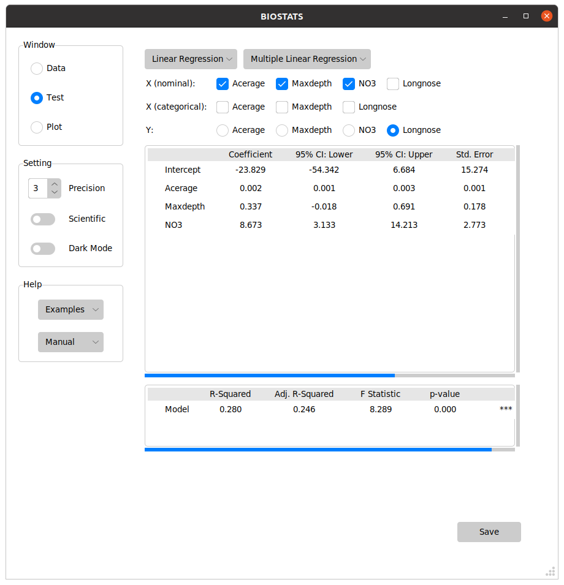
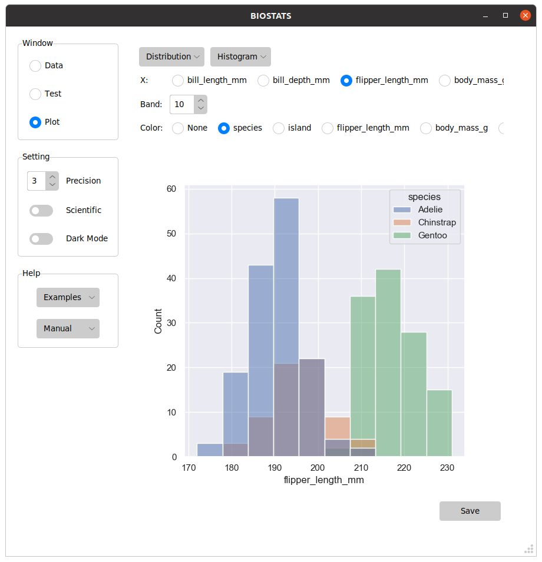
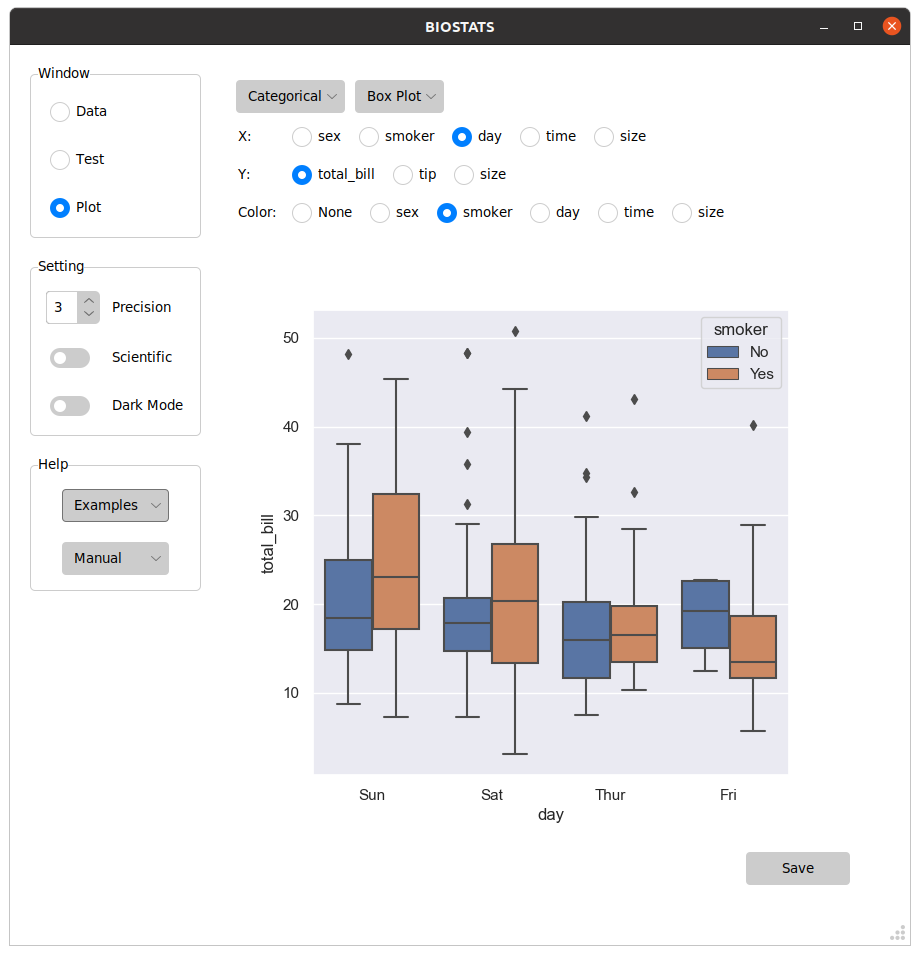
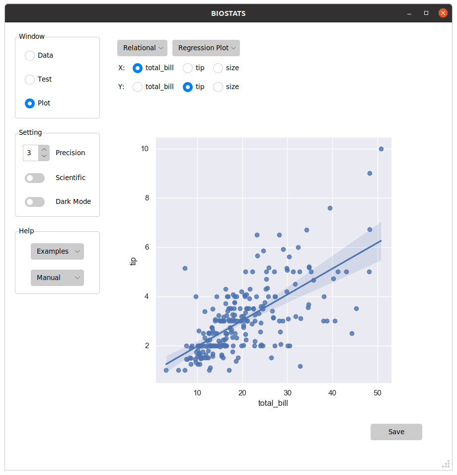
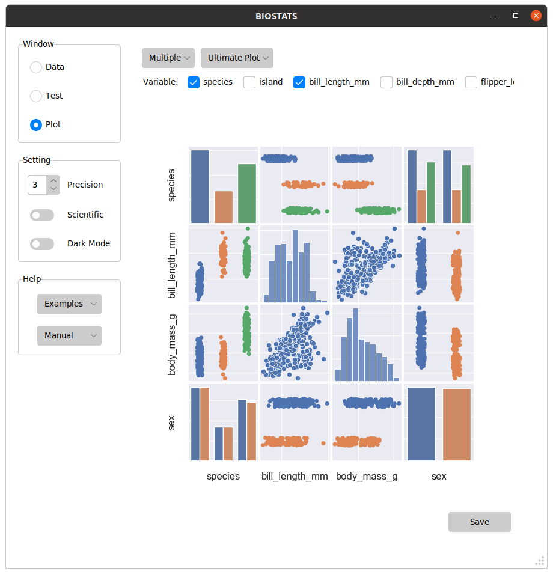

 

 

# __What is BIOSTATS__

* BIOSTATS is an intuitive app for statistical analysis.
* It is free and open-source.
* It works on _Windows_ / _Linux_.

### __You can preform tests with a few clicks__

_t-Test_

_ANOVA_

_Chi-Square Test_

_Regression_

 

### __You can visualize plots with a few clicks__

_Histogram_

_Box Plot_

_Regression Plot_

_Multiple Plot_

 

### __BIOSTATS includes these tests and plots:__

_Tests_

| Basic | t-Test | ANOVA | Exact Test | Chi-Square Test |
|---|---|---|---|---|
| Numeral | One-Sample t-Test | One-Way ANOVA | Binomial Test | Chi-Square Test |
| Numeral (Grouped) | Two-Sample t-Test | Two-Way ANOVA | Fisher's Exact Test | Chi-Square Test (Fit) |
| Categorical | Paired t-Test | One-Way ANCOVA | McNemar's Exact Test | McNemar's Test |
| Contingency | Pairwise t-Test | Two-Way ANCOVA |  | Mantel-Haenszel Test |
|  |  | Multivariate ANOVA |  |  |
|  |  | Repeated Measures ANOVA |  |  |

| Linear Regression | Logistic Regression | Nonparametric | Others |
|---|---|---|---|
| Correlation | Simple Logistic Regression | Sign Test | Screening Test |
| Correlation Matrix | Multiple Logistic Regression | Median Test | Epidemiologic Study |
| Simple Linear Regression | Ordered Logistic Regression | Wilcoxon Signed-Rank Test | Factor Analysis |
| Multiple Linear Regression | Multinomial Logistic Regression | Wilcoxon Rank-Sum Test | Principal Component Analysis |
|  |  | Kruskal-Wallis Test | Linear Discriminant Analysis |
|  |  | Friedman Test |  |
|  |  | Spearman's Rank Correlation |  |

_Plots_

| Distribution | Categorical | Relational | Multiple | Others |
|---|---|---|---|---|
| Histogram | Count Plot | Scatter Plot | Ultimate Plot | Heatmap |
| Density Plot | Strip Plot | Line Plot | Pair Plot | FA Plot |
| Cumulative Plot | Swarm Plot | Regression Plot | Joint Plot | PCA Plot |
| 2D Histogram | Box Plot |  |  | LDA Plot |
| 2D Density Plot | Boxen Plot |  |  |  |
|  | Violin Plot |  |  |  |
|  | Bar Plot |  |  |  |

# __Quick Start__

### __Downloads__

The application can be download from the links below:

_Windows_ : https://github.com/hikarimusic/BIOSTATS/releases/download/cd6da0c/BIOSTATS.exe

_Linux_ : https://github.com/hikarimusic/BIOSTATS/releases/download/cd6da0c/BIOSTATS

_(Your computer )_