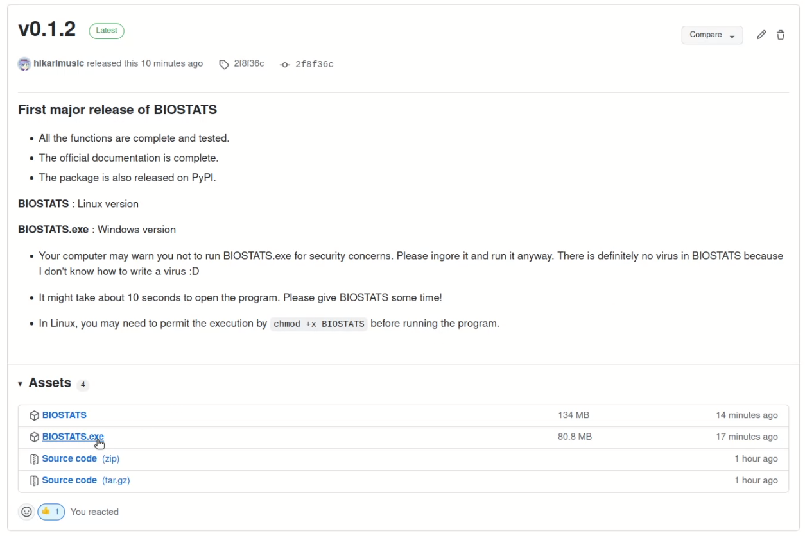
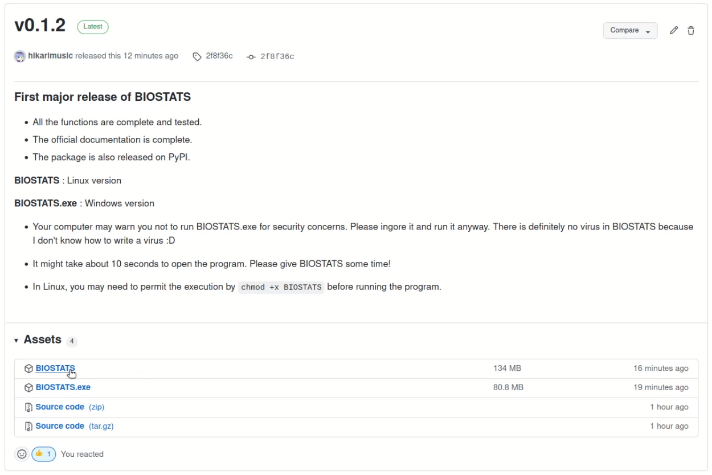

**Download**
============

**Windows**
-----------

You can download the latest version from `Github Release <https://github.com/hikarimusic/BIOSTATS/releases/latest/>`_. Please select the *BIOSTATS.exe* file.

Or you can download it from the link below:

* https://github.com/hikarimusic/BIOSTATS/releases/latest/download/BIOSTATS.exe

Double click the downloaded file to run BIOSTATS.

.. note::
    If *Windows* protect you from running it, please press *More info > Run anyway*. 
    There is definitely no virus in BIOSTATS, and you can check all the codes on the `Github Repository <https://github.com/hikarimusic/BIOSTATS>`_.

.. note::
    Sometimes it will take quite a long time to open BIOSTATS. It is usually due to the virus scanning process of your computer, 
    and I can do nothing about it. Please just wait for a while and maybe have a cup of tea!

**Linux**
---------

You can download the latest version from `Github Release <https://github.com/hikarimusic/BIOSTATS/releases/latest/>`_. Please select the *BIOSTATS* file.

Or you can download it from the link below:

* https://github.com/hikarimusic/BIOSTATS/releases/latest/download/BIOSTATS

Double click the downloaded file to run BIOSTATS. Or you can ``cd`` into the directory where BIOSTATS is in, and run the program by ``./BIOSTATS``.

.. note::
   In Linux, you may need to permit the execution by ``chmod +x BIOSTATS`` before running the program.

**Python Package**
------------------

For users who are familiar with Python, you can download the Python package and use it in the interactive mode or in your own project.
To download the package, run the following command in the terminal:

.. code-block:: 

   pip install biostatistics

You can open the main window directly by the command ``biostats`` in any directory:

.. code-block:: 

   biostats

Or you can use BIOSTATS interactively in the terminal:

.. code-block::

   :~$ python3
   >>> import biostats as bs
   >>> data = bs.dataset("one_way_anova.csv")
   >>> summary, result = bs.one_way_anova(data=data, variable="Length", between="Location")
   >>> summary
        Location  Count      Mean  Std. Deviation  95% CI: Lower  95% CI: Upper
   1   Tillamook     10  0.080200        0.011963       0.071642       0.088758
   2     Newport      8  0.074800        0.008597       0.067613       0.081987
   3  Petersburg      7  0.103443        0.016209       0.088452       0.118434
   4     Magadan      8  0.078012        0.012945       0.067190       0.088835
   5   Tvarminne      6  0.095700        0.012962       0.082098       0.109302
   >>> result
             D.F.  Sum Square  Mean Square  F Statistic   p-value     
   Location     4    0.004520     0.001130     7.121019  0.000281  ***
   Residual    34    0.005395     0.000159          NaN       NaN  NaN

or incorporate BIOSTATS into your own project:

.. code-block:: python

    import biostats as bs
    
    data = bs.dataset("one_way_anova.csv")
    summary, result = bs.one_way_anova(data=data, variable="Length", between="Location")
    print(summary)
    print(result)