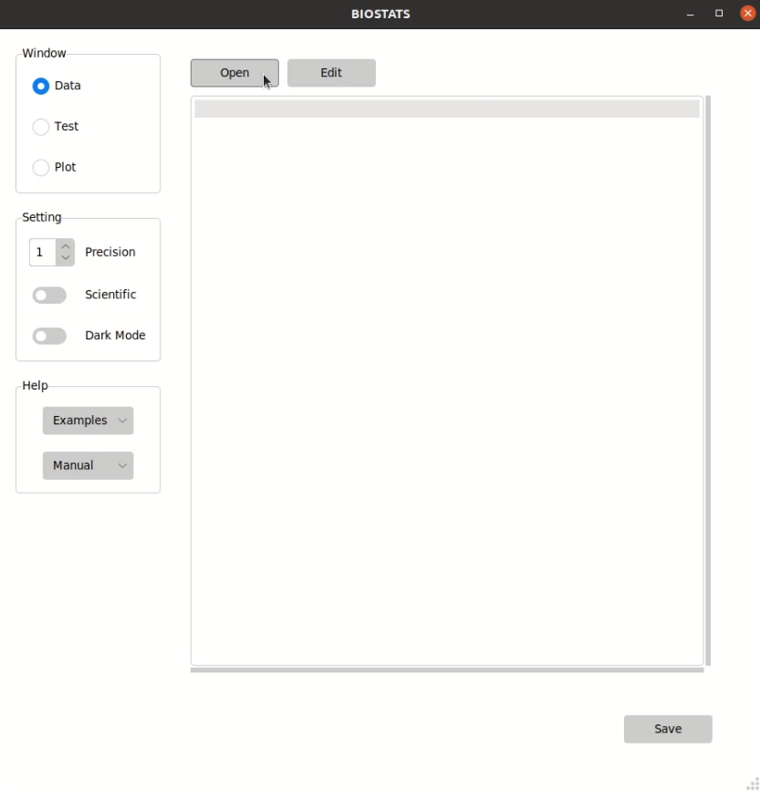
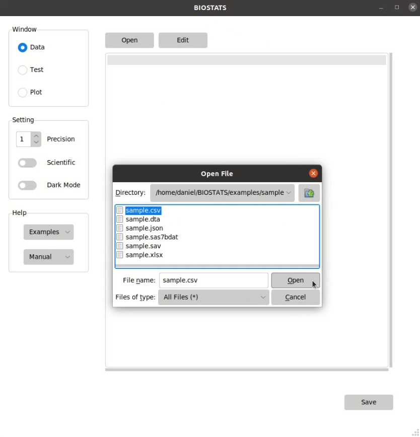
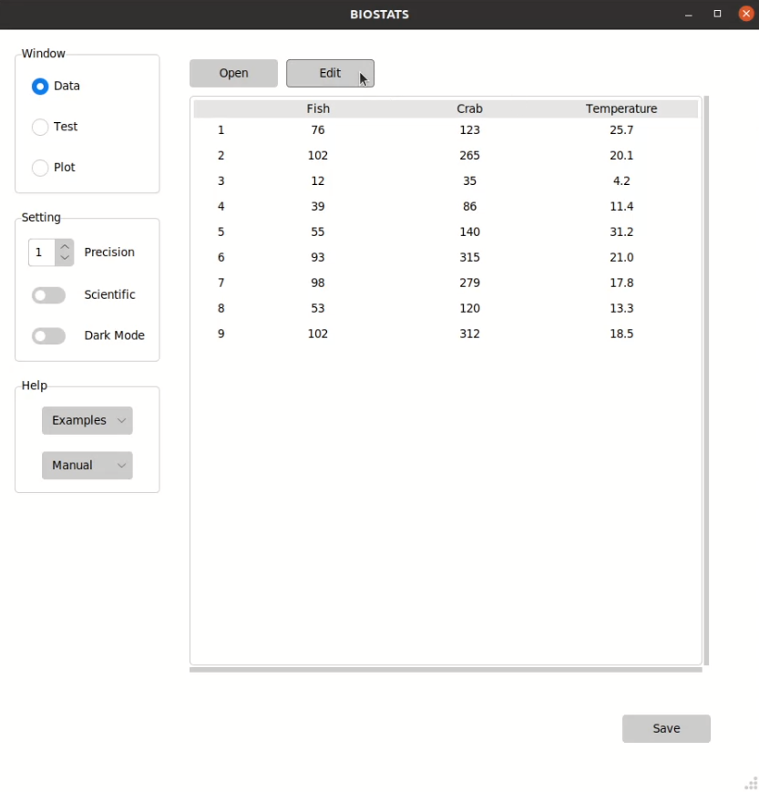
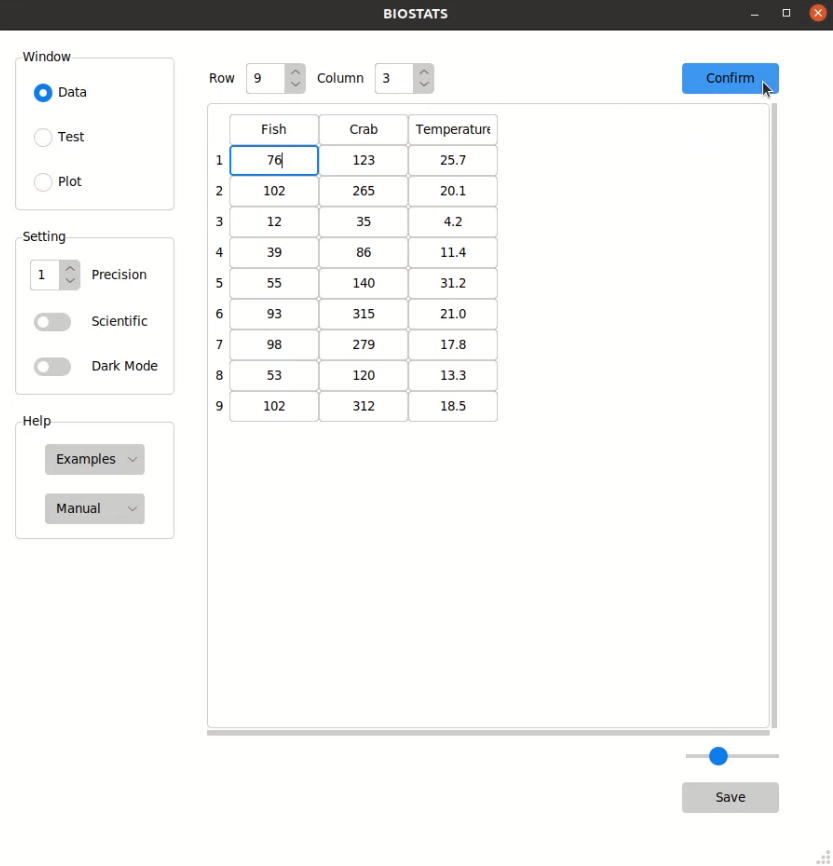
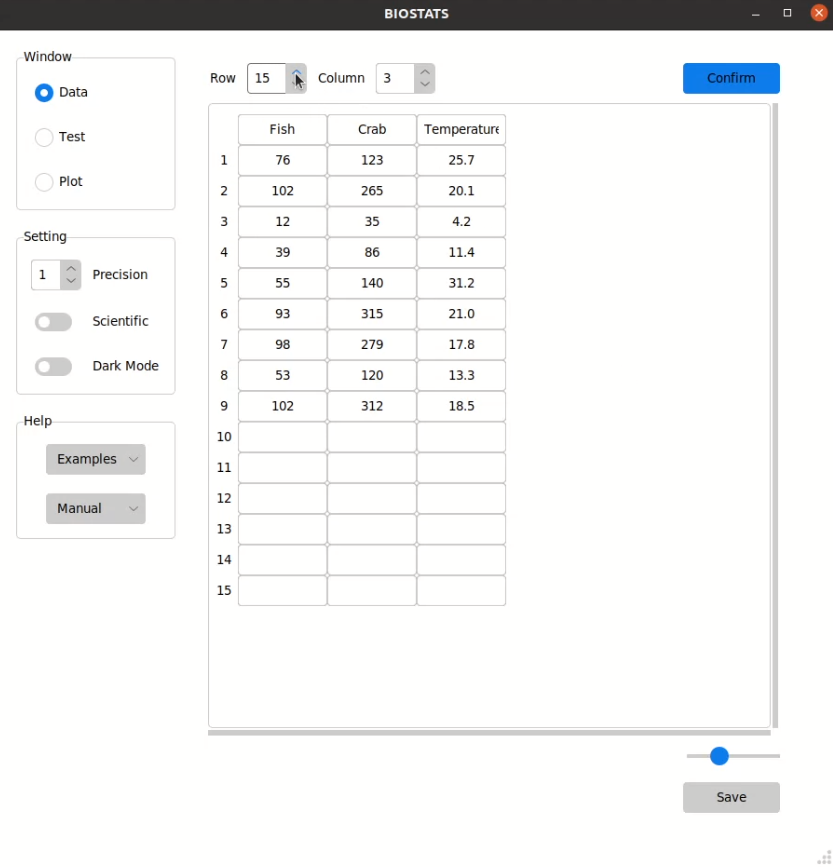
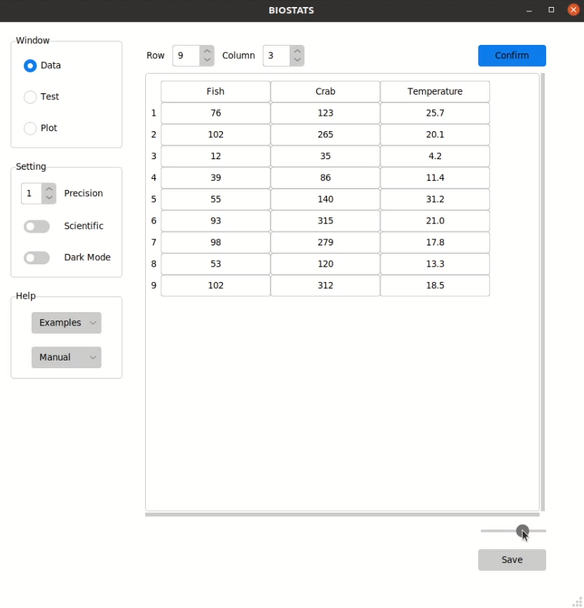
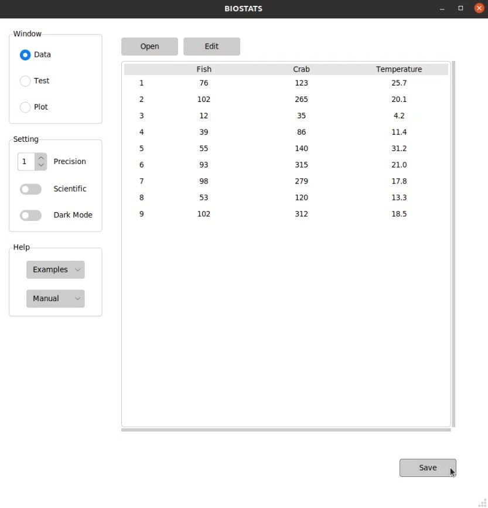
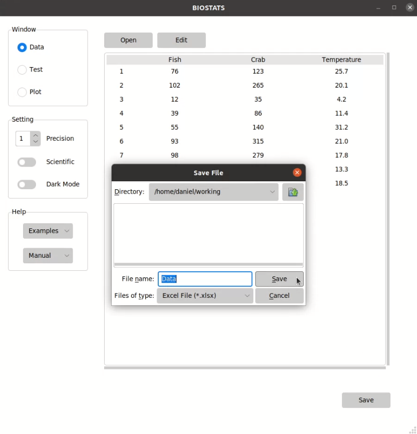

**Handle Data**
===============

Open the data
-------------

You can open the data by pressing *Open* button in *Data* window:

File types that can be opened by BIOSTATS:

+------------+------------+------------------------------------------------------------------------------------------------------+
| File Type  | Extension  |Sample Data                                                                                           |
+============+============+======================================================================================================+
| Excel File | .xlsx      |`sample.xlsx <https://github.com/hikarimusic/BIOSTATS/raw/main/examples/sample/sample.xlsx>`_         |
+------------+------------+------------------------------------------------------------------------------------------------------+
| CSV File   | .csv       |`sample.csv <https://github.com/hikarimusic/BIOSTATS/raw/main/examples/sample/sample.csv>`_           |
+------------+------------+------------------------------------------------------------------------------------------------------+
| JSON File  | .json      |`sample.json <https://github.com/hikarimusic/BIOSTATS/raw/main/examples/sample/sample.json>`_         |
+------------+------------+------------------------------------------------------------------------------------------------------+
| SAS File   | .sas7bdat  |`sample.sas7bat <https://github.com/hikarimusic/BIOSTATS/raw/main/examples/sample/sample.sas7bat>`_   |
+------------+------------+------------------------------------------------------------------------------------------------------+
| Stata File | .dta       |`sample.dta <https://github.com/hikarimusic/BIOSTATS/raw/main/examples/sample/sample.dta>`_           |
+------------+------------+------------------------------------------------------------------------------------------------------+
| SPSS File  | .sav       |`sample.sav <https://github.com/hikarimusic/BIOSTATS/raw/main/examples/sample/sample.sav>`_           |
+------------+------------+------------------------------------------------------------------------------------------------------+

.. tip::

    You can press ``o`` to open the data.

Edit the data
-------------

You can edit the data by pressing *Edit* button in *Data* window. and confirm the change by pressing *Confirm* button:

You can change the number of rows and columns by adjusting the spin boxes above, and change the width of cells by adjusting the scale bar below:

.. tip::

    You can press ``e`` to edit the data. In the edit mode, you can use the arrow keys ``↑ ↓ ← →`` to move to neighboring cells, and press the enter key ``↵`` to confirm the change.

.. warning::

    The maximum number of cells in edit mode is limited to 300 for performance concerns. BIOSTATS is not designed for data editing, and you should use other software such as *Excel* or *Google Sheets* for this purpose.

Save the data
-------------

You can save the data by pressing *Save* button in *Data* window:

File types that can be saved by BIOSTATS:

+----------------+------------+
| File Type      | Extension  |
+================+============+
| Excel File     | .xlsx      |
+----------------+------------+
| CSV File       | .csv       |
+----------------+------------+
| JSON File      | .json      |
+----------------+------------+
| Stata File     | .dta       |
+----------------+------------+
| LaTex File     | .tex       |
+----------------+------------+
| Markdown FIle  | .md        |
+----------------+------------+
| Text File      | .txt       |
+----------------+------------+

.. tip::

    You can press ``Ctrl + s`` to save the data.