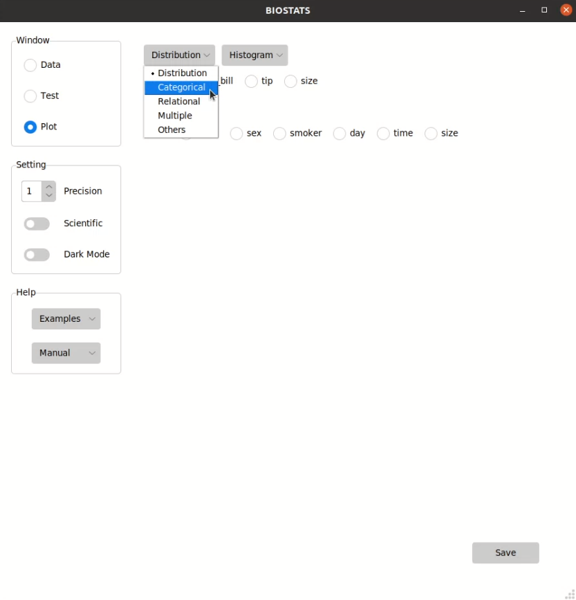
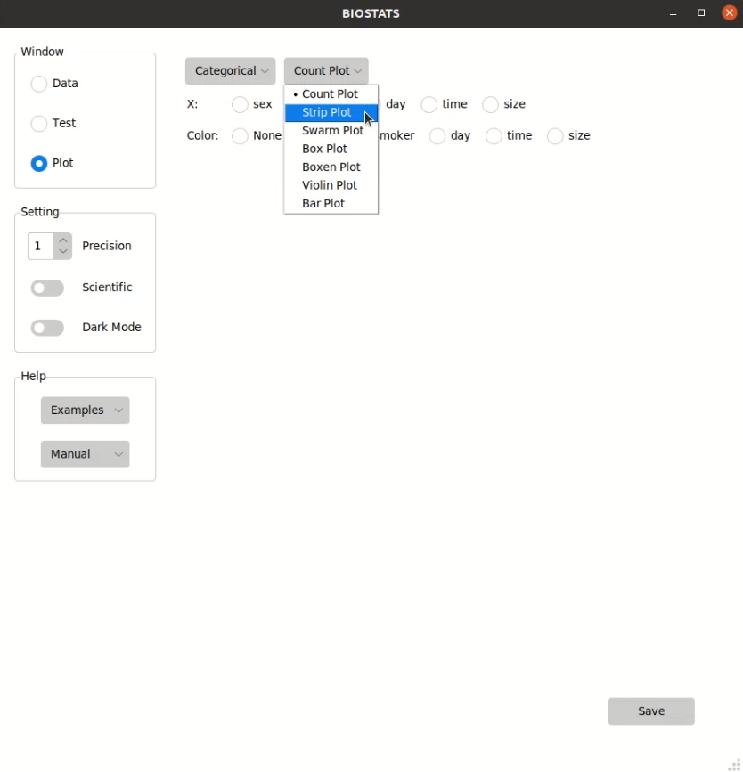
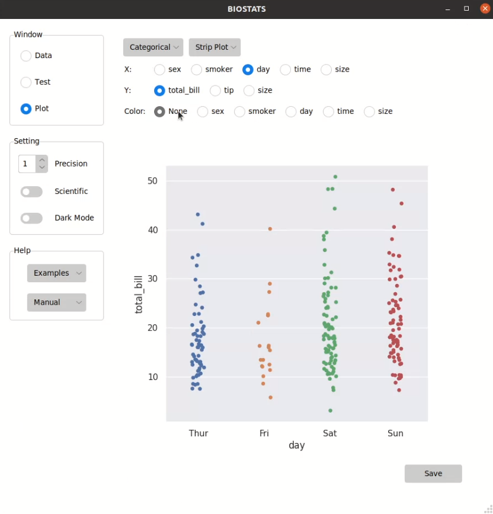
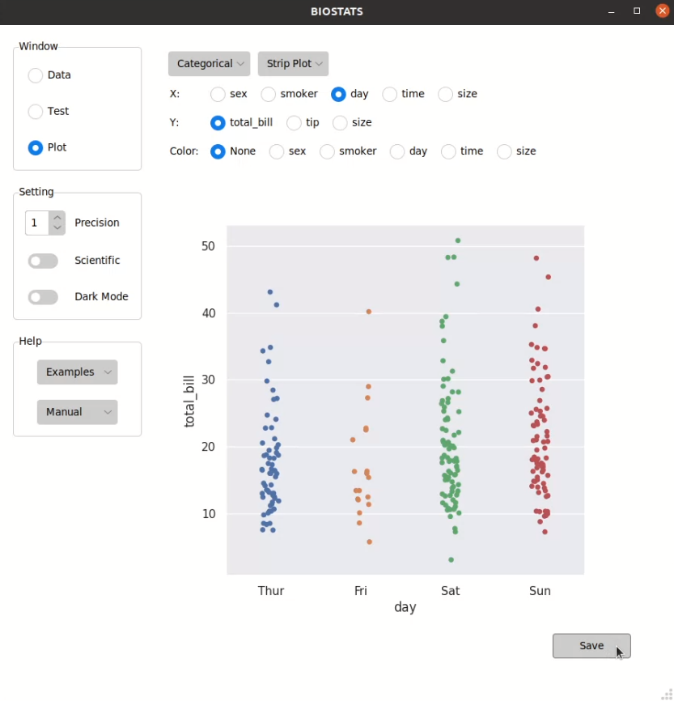
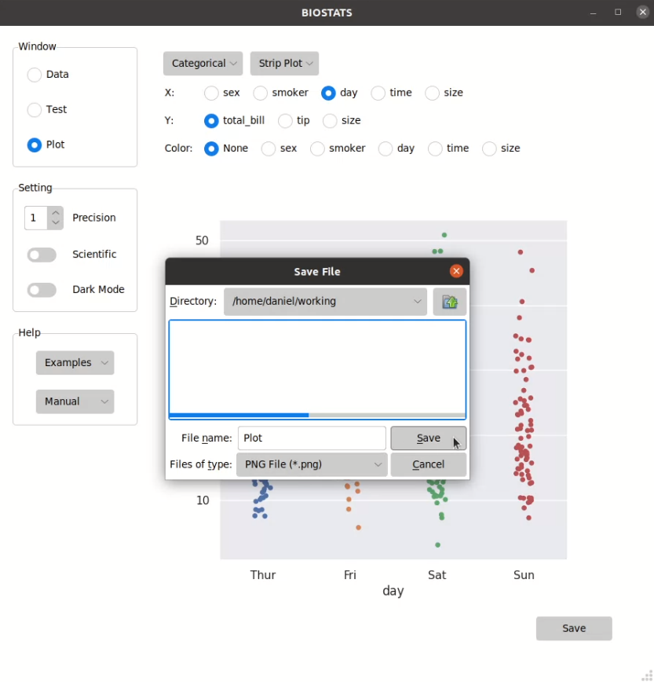

**Draw Plots**
==============

Select a plot
-------------

You can select a plot from the menu in *Plot* window:

.. note::

    All the plots in BIOSTATS are generated by Python package *Seaborn*. For more details, please visit its official site:
    
    * `seaborn: statistical data visualization <https://seaborn.pydata.org/>`_

Choose the options
------------------

You can choose the options from the option bars:

Different kinds of options:

+-----------------+--------------------------+---------------------------+
| Option Type     | Function                 | Note                      |
+=================+==========================+===========================+
| Radio Button    | Choose one option        |                           |
+-----------------+--------------------------+---------------------------+
| Check Button    | Choose multiple options  | Double click to unselect  |
+-----------------+--------------------------+---------------------------+
| Entry Box       | Enter a number           | Press <Enter> to confirm  |
+-----------------+--------------------------+---------------------------+
| Entry Box (>1)  | Enter multiple numbers   | Press <Enter> to confirm  |
+-----------------+--------------------------+---------------------------+
| Spin Box        | Choose a number          |                           |
+-----------------+--------------------------+---------------------------+

.. tip::

    If the length of an option bar is too long and exceeds the display area, you can hover over the option bar and scroll up and down using a mouse or touchpad.

Save the image
--------------

You can save the image by pressing *Save* button in *Plot* window:

File types that can be saved by BIOSTATS:

+------------+------------+
| File Type  | Extension  |
+============+============+
| PNG File   | .png       |
+------------+------------+
| JPEG File  | .jpg       |
+------------+------------+
| PDF File   | .pdf       |
+------------+------------+
| SVG File   | .svg       |
+------------+------------+
| EPS File   | .eps       |
+------------+------------+
| PS File    | .ps        |
+------------+------------+

.. tip::

    You can press ``Ctrl + s`` to save the image.