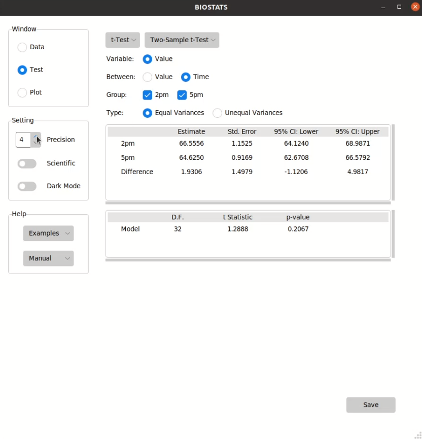
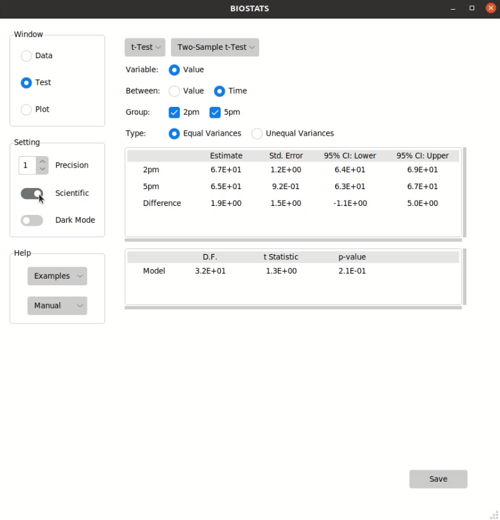
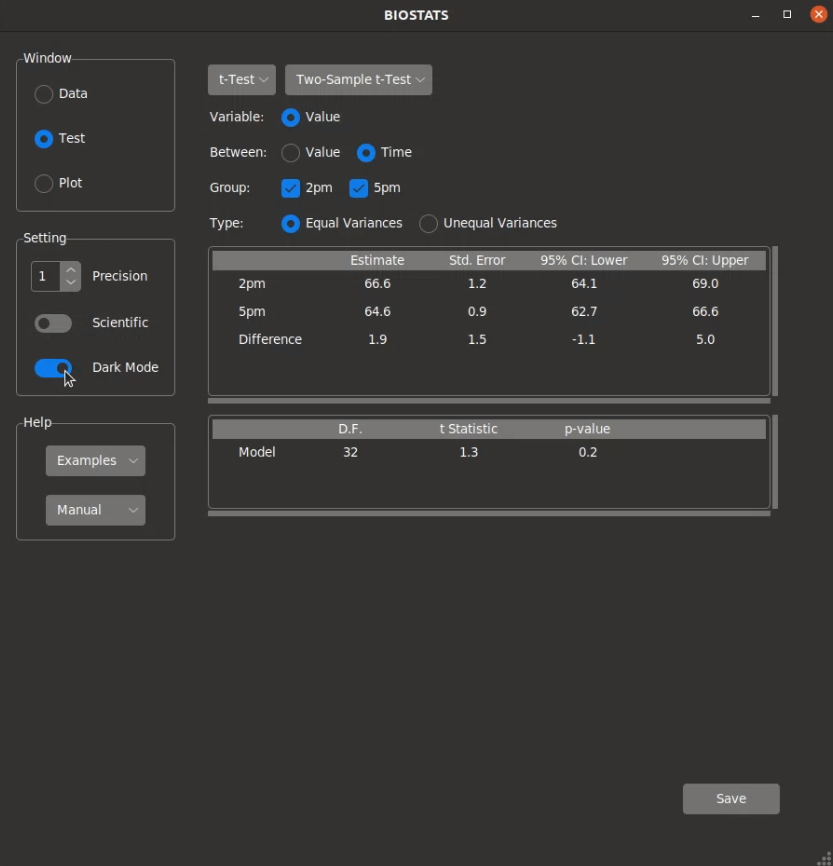

**Setting**
===========

Set the precision
-----------------

You can set the precision of numbers by adjusting *Precision* spin box:

Scientific notation
-------------------

You can change the numbers to scientific notation by turning on *Scientific* switch:

Dark mode
---------

You can change the display to dark mode by turning on *Dark Mode* switch:

