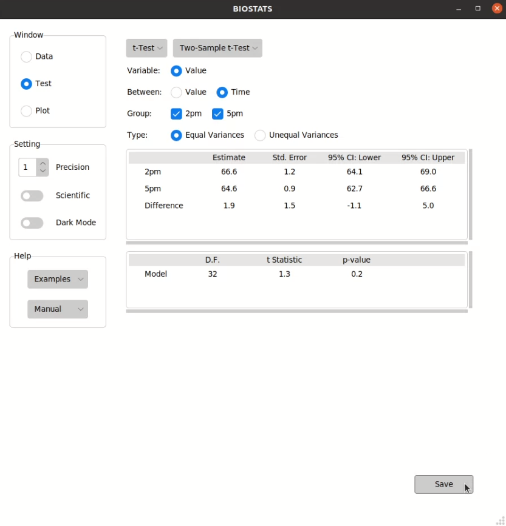

**Perform Tests**
=================

Select a test
-------------

You can select a test from the menu in *Test* window:

.. image:: ../_static/guide/select_test_2.png
   :width: 500

.. tip::

    If you don't know what test you should use, please take a look at :doc:`../reference/index`, or visit the sites below.

    * `Choosing a statistical test <http://www.biostathandbook.com/testchoice.html>`_
    * `What statistical analysis should I use? <https://stats.oarc.ucla.edu/sas/whatstat/what-statistical-analysis-should-i-usestatistical-analyses-using-sas>`_
    * `Statology Tutorials <https://www.statology.org/tutorials/>`_

Choose the options
------------------

You can choose the options from the option bars:

Different kinds of options:

+-----------------+--------------------------+---------------------------+
| Option Type     | Function                 | Note                      |
+=================+==========================+===========================+
| Radio Button    | Choose one option        |                           |
+-----------------+--------------------------+---------------------------+
| Check Button    | Choose multiple options  | Double click to unselect  |
+-----------------+--------------------------+---------------------------+
| Entry Box       | Enter a number           | Press <Enter> to confirm  |
+-----------------+--------------------------+---------------------------+
| Entry Box (>1)  | Enter multiple numbers   | Press <Enter> to confirm  |
+-----------------+--------------------------+---------------------------+
| Spin Box        | Choose a number          |                           |
+-----------------+--------------------------+---------------------------+

.. tip::

    If the length of an option bar is too long and exceeds the display area, you can hover over the option bar and scroll up and down using a mouse or touchpad.

.. note::

    The test results will not show if some options are not properly selected. Please take a look at :doc:`../reference/index` to check the conditions for each test.

Save the result
---------------

You can save the result by pressing *Save* button in *Test* window:

.. image:: ../_static/guide/save_result_2.png
   :width: 500

File types that can be saved by BIOSTATS:

+----------------+------------+
| File Type      | Extension  |
+================+============+
| Excel File     | .xlsx      |
+----------------+------------+
| Markdown FIle  | .md        |
+----------------+------------+
| Text File      | .txt       |
+----------------+------------+

.. tip::

    You can press ``Ctrl + s`` to save the result.